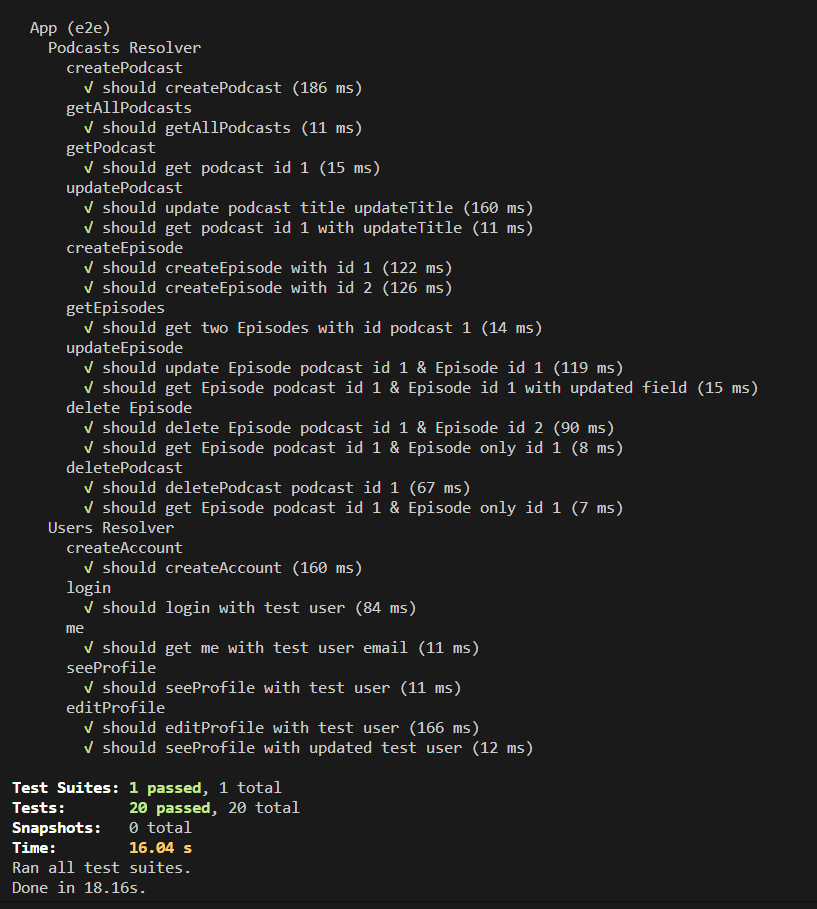

## E2E 테스트

- 유닛테스트와 다르게 Request를 테스트한다.
- 유닛테스트는 하나의 서비스에 대해서 테스트 했다면 end to end 테스트는
- 하나의 request에 걸쳐있는 모듈,서비스를 전부 테스트하게 된다.

## NestJS E2E 테스트

- Jest 라이브러리를 사용
- /test/jest-e2e.json 에 설정이 들어간다.
- 명령어 "test:e2e": "jest --config ./test/jest-e2e.json" 을 실행

## config 설정

- unit test는 package.json 의 jest:{..} 에서 해주었지만
- e2e test 는 test/jest-e2e.json 에서 변경해주자. ( 명령어 셋팅에 config 파일 경로를 이렇게 지정해둠 )

- 절대경로 문제 : moduleNameMapper 을 다음처럼 변경

```ts
{
  "moduleFileExtensions": ["js", "json", "ts"],
  "rootDir": ".",
  "testEnvironment": "node",
  "testRegex": ".e2e-spec.ts$",
  "transform": {
    "^.+\\.(t|j)s$": "ts-jest"
  },
  "moduleNameMapper": {
    "^src/(.*)$": "<rootDir>/../src/$1"
  }
}
```

- jest를 실행하면 NODE_ENV = test 셋팅되어 실행.
- env 문제 : .env.test 파일을 그대로 만들어주고, test DB를 사용하자

```ts
DB_HOST = localhost;
DB_PORT = 5433;
DB_USERNAME = postgres;
DB_PASSWORD = X_X_X_X_X_;
DB_NAME = nuber - eats - test;
SECRET_KEY = y1BBZTgN_X_X_X_X_X___TzxTohPW2;
```

# after All

- Test가 시작할때 (BefereAll) Test가 종료되었을때(AfterAll)
- App 종료
- DB Cleanup

```ts
import { Test, TestingModule } from '@nestjs/testing';
import { INestApplication } from '@nestjs/common';
import \* as request from 'supertest';
import { AppModule } from '../src/app.module';
import { getConnection } from 'typeorm';
describe('UserModule (e2e)', () => {
  let app: INestApplication;
  // app 을 생성하고
  beforeAll(async () => {
    const module: TestingModule = await Test.createTestingModule({
      imports: [AppModule],
    }).compile();
    app = module.createNestApplication();
    await app.init();
  });
  // 테스트가 끝나면( db clean, app close)
  afterAll(async () => {
    await getConnection().dropDatabase();
    await app.close();
  });
  it.todo('me');
});

```

## first test - gql

```ts
import { Test, TestingModule } from "@nestjs/testing";
import { INestApplication } from "@nestjs/common";
import * as request from "supertest";
import { AppModule } from "../src/app.module";
import { getConnection } from "typeorm";

const GRAPHQL_ENDPOINT = "/graphql";

describe("UserModule (e2e)", () => {
  let app: INestApplication; // app 을 생성하고

  beforeAll(async () => {
    const module: TestingModule = await Test.createTestingModule({
      imports: [AppModule],
    }).compile();
    app = module.createNestApplication();
    await app.init();
  }); // 테스트가 끝나면( db clean, app close)

  afterAll(async () => {
    await getConnection().dropDatabase();
    await app.close();
  });

  describe("createAccount", () => {
    it("should create account", () => {
      return request(app.getHttpServer())
        .post(GRAPHQL_ENDPOINT)
        .send({
          query: `
          mutation {
            createAccount(
              input: { email: "test@user.com", password: "test", role: Owner }
            ) {
              error
              ok
            }
          }
        `,
        })
        .expect(200)
        .expect((res) => {
          expect(res.body.data.createAccount.ok).toBe(true);
          expect(res.body.data.createAccount.error).toBe(null);
        });
    });
  });
  it.todo("userProfile");
  it.todo("login");
  it.todo("me");
  it.todo("verifyEmail");
  it.todo("editProfile");
});
```

## header setting 해주기

- set 이용

```ts
describe("me", () => {
  it("should me with test user", () => {
    return request(app.getHttpServer())
      .post(GRAPHQL_ENDPOINT)
      .set("X-JWT", jwtToken)
      .send({
        query: `
            query{
              me{
                id
                email
              }
            }
          `,
      })
      .expect(200)
      .expect((res) => {
        expect(res.body.data.me.id).toBe(1);
        expect(res.body.data.me.email).toBe("test@test.com");
      });
  });
});
```

## mocking email module - got 라이브러리 함수 모킹

- got 이라는 함수를 호출하게되면 jest 모킹함수가 대신함

```ts
jest.mock("got", () => {
  return {
    post: jest.fn(),
  };
});
```

## userRepo 데이터 가져오기

- 직접사용자를 찾고 싶을때, request 가 아닌
- e2e 테스트를 하는동안에도 특정 모듈 사용가능

```ts
describe('UserModule (e2e)', () => {
  let app: INestApplication;
  let usersRepository: Repository<User>;
  let jwtToken: string;

  beforeAll(async () => {
    const module: TestingModule = await Test.createTestingModule({
      imports: [AppModule],
    }).compile();
    app = module.createNestApplication();
    usersRepository = module.get<Repository<User>>(getRepositoryToken(User));
    await app.init();
  });
}
```

## examples



```ts
import * as request from "supertest";
import { Test } from "@nestjs/testing";
import { AppModule } from "./../src/app.module";
import { INestApplication } from "@nestjs/common";
import { getConnection } from "typeorm";

const GRAPHQL_ENDPOINT = "/graphql";

describe("App (e2e)", () => {
  let app: INestApplication;
  let jwtToken: string;

  beforeAll(async () => {
    const moduleFixture = await Test.createTestingModule({
      imports: [AppModule],
    }).compile();

    app = moduleFixture.createNestApplication();
    await app.init();
  });

  afterAll(async () => {
    await getConnection().dropDatabase();
    await app.close();
  });

  describe("Podcasts Resolver", () => {
    describe("createPodcast", () => {
      it("should createPodcast", () => {
        return request(app.getHttpServer())
          .post(GRAPHQL_ENDPOINT)
          .send({
            query: `
              mutation{
                createPodcast(input:{
                  title:"sample",
                  category:"simple"
                }){
                  error
                  ok
                  id
                }
              }
          `,
          })
          .expect(200)
          .expect((res) => {
            console.log(res);
            expect(res.body.data.createPodcast.id).toBe(1);
          });
      });
    });
    describe("getAllPodcasts", () => {
      it("should getAllPodcasts", () => {
        return request(app.getHttpServer())
          .post(GRAPHQL_ENDPOINT)
          .send({
            query: `
          query{
            getAllPodcasts{
              error
              ok
              podcasts{
                id
              }
            }
          }
          `,
          })
          .expect(200);
      });
    });
    describe("getPodcast", () => {
      it("should get podcast id 1", () => {
        return request(app.getHttpServer())
          .post(GRAPHQL_ENDPOINT)
          .send({
            query: `query{
            getPodcast(input:{
              id:1
            }){
              error
              ok
              podcast{
                id
                createdAt
                updatedAt
                title
                rating
              }
            }
          }`,
          })
          .expect(200)
          .expect((res) => {
            expect(res.body.data.getPodcast.error).toBe(null);
            expect(res.body.data.getPodcast.ok).toBe(true);
            expect(res.body.data.getPodcast.podcast).toEqual(
              expect.any(Object)
            );
          });
      });
    });

    describe("updatePodcast", () => {
      it("should update podcast title updateTitle", () => {
        return request(app.getHttpServer())
          .post(GRAPHQL_ENDPOINT)
          .send({
            query: `
          mutation {
            updatePodcast(input: { id: 1, payload: { title: "updateTitle" } }) {
              error
              ok
            }
          }
          `,
          })
          .expect(200)
          .expect((res) => {
            expect(res.body.data.updatePodcast.ok).toBe(true);
            expect(res.body.data.updatePodcast.error).toBe(null);
          });
      });

      it("should get podcast id 1 with updateTitle", () => {
        return request(app.getHttpServer())
          .post(GRAPHQL_ENDPOINT)
          .send({
            query: `query{
            getPodcast(input:{
              id:1
            }){
              error
              ok
              podcast{
                id
                createdAt
                updatedAt
                title
                rating
              }
            }
          }`,
          })
          .expect(200)
          .expect((res) => {
            expect(res.body.data.getPodcast.error).toBe(null);
            expect(res.body.data.getPodcast.ok).toBe(true);
            expect(res.body.data.getPodcast.podcast.title).toEqual(
              "updateTitle"
            );
          });
      });
    });

    describe("createEpisode", () => {
      it("should createEpisode with id 1", () => {
        return request(app.getHttpServer())
          .post(GRAPHQL_ENDPOINT)
          .send({
            query: `
          mutation{
            createEpisode(input:{
              podcastId:1,
              title:"eTitle1",
              category:"eCategory1"
            }){
              error
              ok
              id
            }
          }
          `,
          })
          .expect(200)
          .expect((res) => {
            expect(res.body.data.createEpisode.ok).toBe(true);
            expect(res.body.data.createEpisode.error).toBe(null);
            expect(res.body.data.createEpisode.id).toBe(1);
          });
      });
      it("should createEpisode with id 2", () => {
        return request(app.getHttpServer())
          .post(GRAPHQL_ENDPOINT)
          .send({
            query: `
          mutation{
            createEpisode(input:{
              podcastId:1,
              title:"eTitle2",
              category:"eCategory2"
            }){
              error
              ok
              id
            }
          }
          `,
          })
          .expect(200)
          .expect((res) => {
            expect(res.body.data.createEpisode.ok).toBe(true);
            expect(res.body.data.createEpisode.error).toBe(null);
            expect(res.body.data.createEpisode.id).toBe(2);
          });
      });
    });
    describe("getEpisodes", () => {
      it("should get two Episodes with id podcast 1", () => {
        return request(app.getHttpServer())
          .post(GRAPHQL_ENDPOINT)
          .send({
            query: `
            query {
              getEpisodes(input: { id: 1 }) {
                error
                ok
                episodes {
                  id
                  title
                }
              }
            }
          `,
          })
          .expect(200)
          .expect((res) => {
            expect(res.body.data.getEpisodes.ok).toBe(true);
            expect(res.body.data.getEpisodes.error).toBe(null);
            expect(res.body.data.getEpisodes.episodes).toEqual(
              expect.any(Array)
            );
            expect(res.body.data.getEpisodes.episodes[0].id).toEqual(1);
          });
      });
    });

    describe("updateEpisode", () => {
      it("should update Episode podcast id 1 & Episode id 1", () => {
        return request(app.getHttpServer())
          .post(GRAPHQL_ENDPOINT)
          .send({
            query: `
            mutation {
              updateEpisode(
                input: {
                  podcastId: 1
                  episodeId: 1
                  title: "updatedTitle"
                  category: "updatedCategory"
                }
              ) {
                error
                ok
              }
            }
          `,
          })
          .expect(200)
          .expect((res) => {
            expect(res.body.data.updateEpisode.ok).toBe(true);
            expect(res.body.data.updateEpisode.error).toBe(null);
          });
      });
      it("should get Episode podcast id 1 & Episode id 1 with updated field", () => {
        return request(app.getHttpServer())
          .post(GRAPHQL_ENDPOINT)
          .send({
            query: `
            query {
              getEpisodes(input: { id: 1 }) {
                error
                ok
                episodes {
                  id
                  title
                  category
                }
              }
            }
          `,
          })
          .expect(200)
          .expect((res) => {
            expect(res.body.data.getEpisodes.ok).toBe(true);
            expect(res.body.data.getEpisodes.error).toBe(null);
            expect(res.body.data.getEpisodes.episodes).toEqual(
              expect.any(Array)
            );
            expect(res.body.data.getEpisodes.episodes[0].id).toEqual(1);
            expect(res.body.data.getEpisodes.episodes[0].title).toEqual(
              "updatedTitle"
            );
            expect(res.body.data.getEpisodes.episodes[0].category).toEqual(
              "updatedCategory"
            );
          });
      });
    });

    describe("delete Episode", () => {
      it("should delete Episode podcast id 1 & Episode id 2", () => {
        return request(app.getHttpServer())
          .post(GRAPHQL_ENDPOINT)
          .send({
            query: `
            mutation{
              deleteEpisode(input:{
                podcastId:1,
                episodeId:2
              }){
                error
                ok
              }
            }
          `,
          })
          .expect(200)
          .expect((res) => {
            expect(res.body.data.deleteEpisode.ok).toBe(true);
            expect(res.body.data.deleteEpisode.error).toBe(null);
          });
      });
      it("should get Episode podcast id 1 & Episode only id 1", () => {
        return request(app.getHttpServer())
          .post(GRAPHQL_ENDPOINT)
          .send({
            query: `
            query {
              getEpisodes(input: { id: 1 }) {
                error
                ok
                episodes {
                  id
                  title
                  category
                }
              }
            }
          `,
          })
          .expect(200)
          .expect((res) => {
            expect(res.body.data.getEpisodes.ok).toBe(true);
            expect(res.body.data.getEpisodes.error).toBe(null);
            expect(res.body.data.getEpisodes.episodes).toEqual(
              expect.any(Array)
            );
            expect(res.body.data.getEpisodes.episodes.length).toEqual(1);
          });
      });
    });

    describe("deletePodcast", () => {
      it("should deletePodcast podcast id 1", () => {
        return request(app.getHttpServer())
          .post(GRAPHQL_ENDPOINT)
          .send({
            query: `
            mutation{
              deletePodcast(input:{
                id:1
              }){
                error
                ok
              }
            }
          `,
          })
          .expect(200)
          .expect((res) => {
            expect(res.body.data.deletePodcast.ok).toBe(true);
            expect(res.body.data.deletePodcast.error).toBe(null);
          });
      });
      it("should get Episode podcast id 1 & Episode only id 1", () => {
        return request(app.getHttpServer())
          .post(GRAPHQL_ENDPOINT)
          .send({
            query: `
            query{
              getAllPodcasts{
                error
                ok
                podcasts{
                  id
                }
              }
            }
          `,
          })
          .expect(200)
          .expect((res) => {
            expect(res.body.data.getAllPodcasts.ok).toBe(true);
            expect(res.body.data.getAllPodcasts.error).toBe(null);
            expect(res.body.data.getAllPodcasts.podcasts).toEqual(
              expect.any(Array)
            );
            expect(res.body.data.getAllPodcasts.podcasts.length).toEqual(0);
          });
      });
    });

    // it.todo('getAllPodcasts');
    // it.todo('getPodcast');
    // it.todo('createPodcast');
    // it.todo('updatePodcast');
    // it.todo('createEpisode');

    // it.todo('getEpisodes');
    // it.todo('updateEpisode');
    // it.todo('deleteEpisode');

    // it.todo('deletePodcast');
  });
  describe("Users Resolver", () => {
    describe("createAccount", () => {
      it("should createAccount", () => {
        return request(app.getHttpServer())
          .post(GRAPHQL_ENDPOINT)
          .send({
            query: `
              mutation{
                createAccount(input:{
                  email:"test@test.com",
                  password:"1234",
                  role:Host
                }){
                  error
                  ok
                }
              }
            `,
          })
          .expect(200)
          .expect((res) => {
            expect(res.body.data.createAccount.ok).toBe(true);
            expect(res.body.data.createAccount.error).toBe(null);
          });
      });
    });
    describe("login", () => {
      it("should login with test user", () => {
        return request(app.getHttpServer())
          .post(GRAPHQL_ENDPOINT)
          .send({
            query: `
          mutation {
            login(input: { email: "test@test.com", password: "1234" }) {
              error
              ok
              token
            }
          }
          
          `,
          })
          .expect(200)
          .expect((res) => {
            expect(res.body.data.login.ok).toBe(true);
            expect(res.body.data.login.error).toBe(null);
            expect(res.body.data.login.token).toEqual(expect.any(String));
            jwtToken = res.body.data.login.token;
          });
      });
    });
    describe("me", () => {
      it("should me with test user", () => {
        return request(app.getHttpServer())
          .post(GRAPHQL_ENDPOINT)
          .set("X-JWT", jwtToken)
          .send({
            query: `
            query{
              me{
                id
                email
              }
            }
          `,
          })
          .expect(200)
          .expect((res) => {
            expect(res.body.data.me.id).toBe(1);
            expect(res.body.data.me.email).toBe("test@test.com");
          });
      });
    });
    // it.todo('createAccount');
    // it.todo('login');
    it.todo("me");
    it.todo("seeProfile");
    it.todo("editProfile");
  });
});
```

## 참조)

[https://github.com/nomadcoders/nuber-eats-backend/commit/110a531f0b02652fbaf713b9eccab476fdffcd44](https://github.com/nomadcoders/nuber-eats-backend/commit/110a531f0b02652fbaf713b9eccab476fdffcd44)
