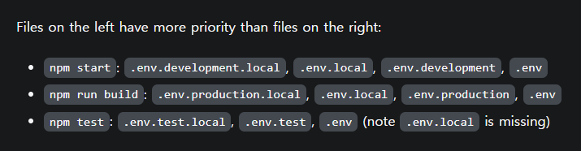
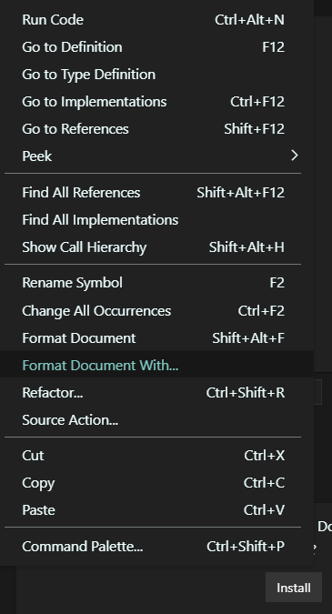
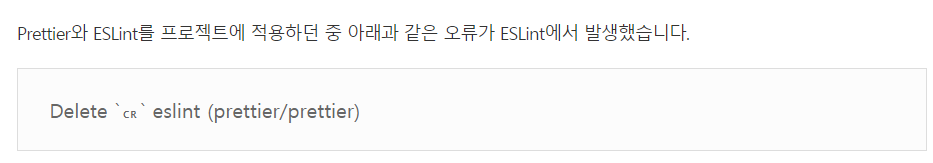

## jsconfig.json

### 절대 경로 지정 ㄱ사능

```js
{
  "compilerOptions": {
    "baseUrl": "src"
  },
  "include": ["src"]
}
```

## .env

### REACT ENV

-     규칙 : CRA에서는 접두사 REACT_APP_ 이라고 해야, .env 의 변수들을 인식한다.
- eg)

```js

	REACT_APP_API_KEY =   AIzaSyXXX250GHkaqGzXXXnlCxUx8
	REACT_APP_AUTH_DOMAIN =   XXXX-aae76.fireXXpp.com
	REACT_APP_DATABASE_URL =   https://nwitterXXXXebaseio.com
	REACT_APP_PROJECT_ID =XX-aae76
	REACT_APP_STORAGE_BUCKET =XX-aae76.appspot.com
	REACT_APP_MESSAGIN_ID =   914XX71917
	REACT_APP_APP_ID =   1:91XXXX:web:3fd2d1XXXd7e5ec4


	// Firebase App (the core Firebase SDK) is always required and must be listed first
	import * as firebase from "firebase/app";

	const firebaseConfig = {
	  apiKey: process.env.REACT_APP_API_KEY,
	  authDomain: process.env.REACT_APP_AUTH_DOMAIN,
	  databaseURL: process.env.REACT_APP_DATABASE_URL,
	  projectId: process.env.REACT_APP_PROJECT_ID,
	  storageBucket: process.env.REACT_APP_STORAGE_BUCKET,
	  messagingSenderId: process.env.REACT_APP_MESSAGIN_ID,
	  appId: process.env.REACT_APP_APP_ID,
	};
	// Initialize Firebase
export default firebase.initializeApp(firebaseConfig);
```

### #. env 개발 , 베포

- 요약 : 아래 두 파일을 만들어서 관리하면, dev서버와 build 각각 잘 들어간다.

  .env.development  
  .env.production

- 참고) 다음과 같은 .env 라벨이 가능
  

- 참고)CRA 에서 각 명령어 마다 파일 .env 우선순위가 있다.  
   start  
   build  
   

## formatter - Prettier

포멧터

- 적용 안됄때
  

VS Code 프리티어가 안될때

[https://stackoverflow.com/questions/52586965/why-prettier-does-not-format-code-in-vscode/62826397#62826397](https://stackoverflow.com/questions/52586965/why-prettier-does-not-format-code-in-vscode/62826397#62826397)

## .eslintrc.js

# 오류 - CRLF,LF

    - 해결 : 자동 endOfLine


https://noogoonaa.tistory.com/62

````js
module.exports = {
  extends: ['react-app', 'prettier', 'plugin:prettier/recommended', 'plugin:@typescript-eslint/eslint-recommended'],
  plugins: ['react', 'prettier', '@typescript-eslint'],
  env: {
    browser: true,
    jest: true
  },
  rules: {
    camelcase: 0,
    'prettier/prettier': [
      'error',
      {
        endOfLine: 'auto'
      }
    ]
  },
  settings: {
    react: {
      pragma: 'React',
      version: 'detect'
    }
  },
  parser: 'babel-eslint'
}```
````
