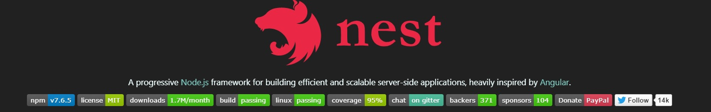

# 깃허브에 벳지 넣기

- NestJS 공식문서에 벳지를 어떻게 만들 수 있을까 해서 찾아봤다. 방법은 간단했다.



- 아래 사이트 이용해서 벳지 만들기  
  [https://shields.io/](https://shields.io/)
- 마크다운 삽입  
  eg

```
- Blog

   [https://dosimpact-til.netlify.app/](https://dosimpact-til.netlify.app/)

  <a href="https://dosimpact-til.netlify.app/"></a>

```
