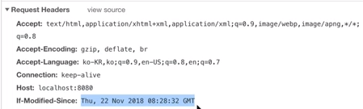

## 개요

[https://opentutorials.org/module/3830](https://opentutorials.org/module/3830)

- 캐쉬 장점 : 빠른 로딩
- 캐쉬 이슈 : 최신 상태 유지해야함

## 캐쉬 X - no store

### 아파치 서버 config 변경

- 헤더에 캐쉬 컨트롤 : no store 설정
- Hard Reload를 통해 캐쉬 지우고 다시 다운로드
- 속도는 Fast3G 로 가정, Preserlog on,

- Header 지정된 캐쉬 컨트롤 셋팅을 볼 수 있다.

## 캐쉬 O - max age

https://developer.mozilla.org/en-US/docs/Web/HTTP/Caching

- 캐쉬 시간 ( 1년 지정 )
  
- 메모리 캐쉬, 디스크 캐쉬 확인가능
- 내용의 신선도가 문제다. ( 이게 최신정보인지 어떻게 알아! )
  

## 캐쉬 - 컨트롤

- 캐쉬 컨트롤: max-age 을 5초로 셋팅해보자.
- 5초 마다 소량의 통신만 하고 끝나버린다.  
  
- 또한 응답헤더에는 Last-Modified 파일이 있다.
- 마지막 수정 시간 정보가 있다.  
  
- 웹 브라우져가 , 수정시간 정보를 묻는다.
  
- 서버의 응답이 304 - 수정 안되어있다. ( header만 주고 받는다. )
  

## 캐쉬 셋팅 요약

- No-cache : 캐슁을 안하는게 아니라, 항상 수정 여부를 header만 가지고 체크를 한다.

## Etag

- Etag : 마지막 수정시간은 1초마다 주고받지만, 실제 컴퓨터는 1초에 무수히 많은 연산을 한다. 그 보안책

- 캐쉬 저장시 ETag와 함께 저장 한다.
  
- Etag 도 매칭하는 여부를 묻는다.
- 웹서버는 if 두 요청값을 확인해서 하나라도 다르면 파일을 보내준다.
  

## More 캐쉬 결정 트리

https://developers.google.com/web/fundamentals/performance/get-started/httpcaching-6

- 캐쉬 사용안할래 : no-store
- 캐쉬 매번 체크할래 : no-cache
- 캐쉬 중재자 사용할래 : public / ( private )
- 캐쉬 매번 체크하지 않고 수명을 정할래 : max-age
- Etag : 헤더 우선 넣어라

## More 캐쉬 검사

- 크롬 - Audit : 잘 저장 하는지 여부 검사할 수 있다.
- PWA : 그렇게 캐쉬관리를 잘 해서 오프라인에서도 ( 앱처럼 ) 잘 사용하도록 만든기술

- Memcached : 메모리 캐쉬를 이용해서 빠른 서비스 제공함
- CDN : 컨텐츠를 분산저장해서 빠른 서비스 제공

## 참조

- 생활코딩
