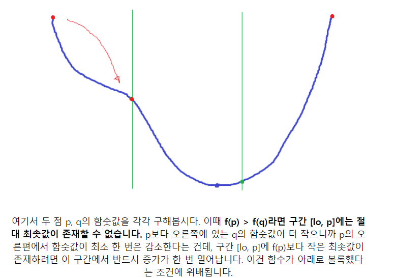

## 삼분 탐색

### 목적

이분탐색은 단조 증가 및 감소에서 로그시간안에 검색이 가능한 탐색이다.  
( 단조 증가 및 감소 조건때문에 선형탐색 ( linear search )와 다르게 정렬이 선행되어야 했다. )  
삼분탐색은 이분탐색보다 1차원 높은, 볼록함수에서 극값(최소값) 을 찾을 수 있다.

### 수학적 지식/직관

1. 내분점 공식으로 좌표를 계산할 수 있다.

2. 3등분한결과, 최소값의 위치 판단가능



### 알고리즘

Low,high 구간에서  
Low, p, q , high 로 3등분을 한다.  
F(p) > F(q) ( 오른쪽의 값이 높다면 ) 왼쪽 구간을 버린다.  
반대의 경우라면 오른쪽 구간을 버린다.

## 기본 예제 1

https://www.acmicpc.net/problem/11662

### 삼분 탐색 적용하기

1.  Low, high 는 0~100 으로 비율값만을 계산하는 구간을 따로 둔다.
2.  삼등분 구간 p,q 를 만든다. 이는 비율값으로 사용할 목적임
3.  내분점 공식을 이용해서 민호와 강호의 좌표를 구한다.
4.  P일때 거리와 Q일때 거리를 구해서 버릴 구간을 정한다.
5.  오차가 10\*\*-6 이 될때까지 삼분탐색을 반복한다.

### 잘못된접근

- 미분을 해볼까?
- 일차함수를 구해볼까?

### 코드

```py
import sys
import math
import re
from typing import *
input = sys.stdin.readline
sys.setrecursionlimit(10**6)

pos = list(map(int, input().split()))
A = [pos[0], pos[1]]
B = [pos[2], pos[3]]
C = [pos[4], pos[5]]
D = [pos[6], pos[7]]
low, high = 0, 100

def mPoint(p):  # A,B > 내분점
    return (A[0] + (B[0] - A[0])*(p/100), A[1] + (B[1] - A[1])*(p/100))

def gPoint(p):  # C,D > 내분점
    return (C[0] + (D[0] - C[0])*(p/100), C[1] + (D[1] - C[1])*(p/100))

ans = math.inf
while high - low >= 1e-6:
    p = (low*2+high*1)/3
    q = (low*1+high*2)/3
    m_pPoint = mPoint(p)
    m_qPoint = mPoint(q)
    g_pPoint = gPoint(p)
    g_qPoint = gPoint(q)
    # p에서 민호강호 거리
    dist_p = (m_pPoint[0] - g_pPoint[0])**2 + (m_pPoint[1] - g_pPoint[1])**2
    dist_q = (m_qPoint[0] - g_qPoint[0])**2 + (m_qPoint[1] - g_qPoint[1])**2
    dist_p = math.sqrt(dist_p)
    dist_q = math.sqrt(dist_q)
    ans = min(dist_p, dist_q)
    if dist_p > dist_q:
        low = p
    else:
        high = q
print("%0.10f" % ans)
"""
print((10)**(-6))
print(1e-06)
"""
```

## 참조자료

https://m.blog.naver.com/PostView.nhn?blogId=kks227&logNo=221432986308&proxyReferer=https:%2F%2Fwww.google.com%2F
https://ddamddi.github.io/algorithm/2020/04/21/boj-11662/
