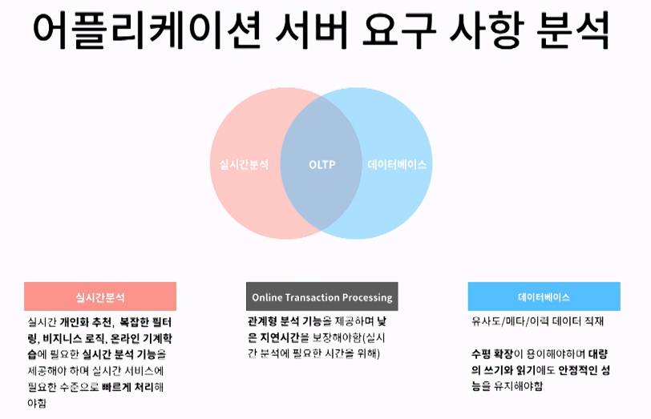
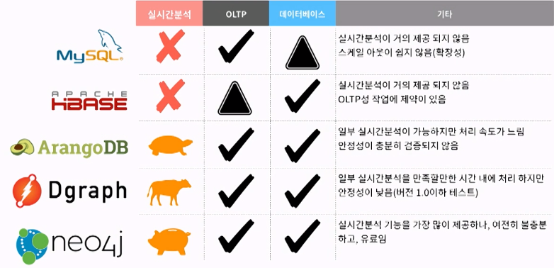
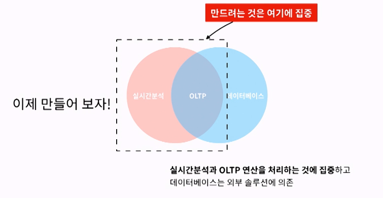
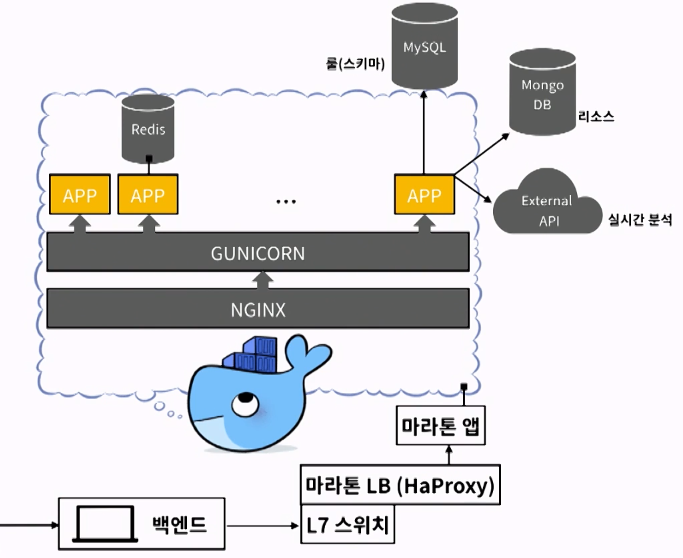
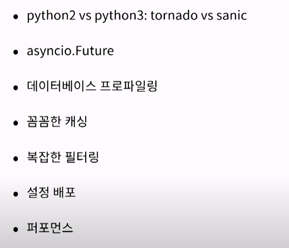
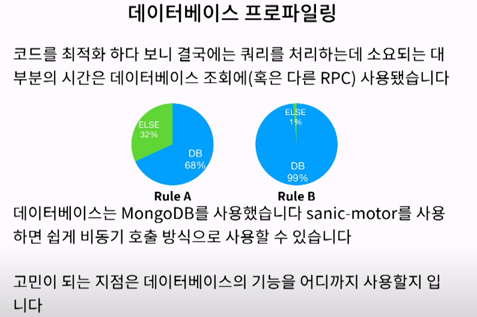
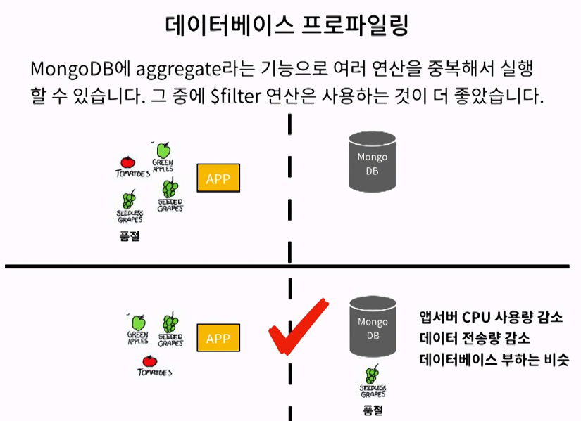
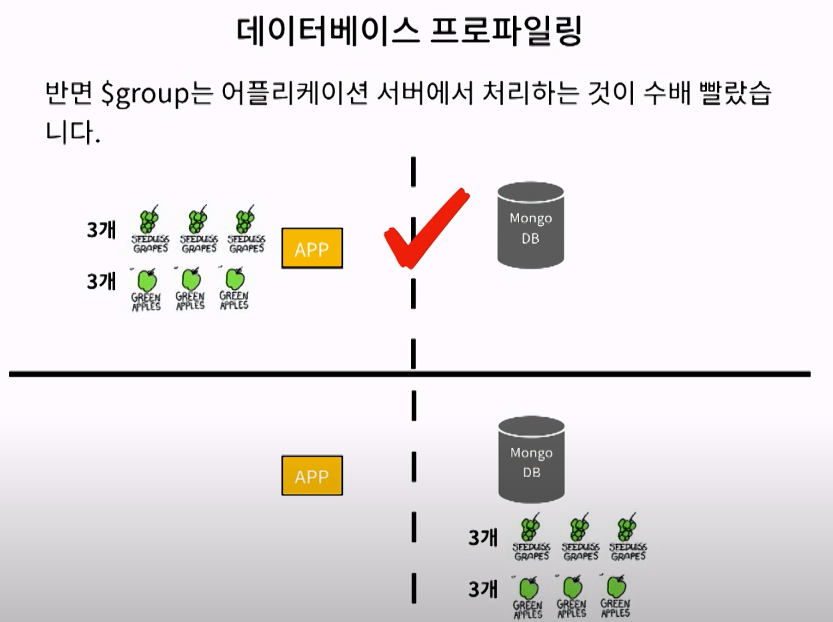

```
추천 시스템을 위한 어플리케이션 서버 개발 후기 @ kakao - 김광섭
패턴인식 전공 / 추천시스템 머신러닝 관심
```

## 추천시스템 최종 목적

### 데이터를 소비하는 새로운 경험

음악, 블로그, 뉴스, 영화 등 이미 많이 적용이 되어있다.  
추천시스템은 복잡한 문제다.

하지만 간단하게 보면 두가지가 있다.

1.  아이템 > 비슷한 아이템 추천
2.  개인 > 개인이 좋아하는 아이템 추천

## 요구사항 분석



OLTP : 온라인 트랜젝션 프로세싱 , 두 개 이상의 테이블을 이용한 관계연산




- 실시간문석 및 OLTP 최적화가 미션
- DB는 외부 솔루션 이용

  

- 마라톤 앞, 로드밸런서도 앞단
- 가상화,컨테이너,nignx
- 여러 파이썬 프로세스 뛰우고 관리한다.
- MongoDB 에는 원본 리소스
- MySQL 에는 미리 지정된 스키마를 저장해 둔다.

## 7가지 실수할만한 얘기



### python2 vs python3

- 파이선 uvloop 이벤트 드리븐 처리가 빠르다.

###

- 비동기 io처리 : 한 퀴리안에서도 최적화

### 데이터 베이스 프로파일링



OLTP 와 관련 - 파이썬 코드를 최적화를 했다. 그럼에도
DB 프로파일링 해보니 결국 네트워크 IO가 걸린다.
RuleA : 전체 시간의 32%만 CPU사용
RuleB : 나머지는 99% 가 네트워크 IO

데이터베이스의 응답속도가 매우 중요했다.



1. DB에서 조건절을 걸어서 가져오는게 훨씬 좋다.
2. APP에서 많은 데이터를 가져와서 필터링하는게 대체적으로 느렸다.

- Mongo의 $aggregate 기능 중 $filter 는 성능이 더 좋았다.

3. 반면

- Mongo의 $group은 어플리케이션 서버에서 처리하는것이 수배 빨랐다.

DB에서 Group by없이
App의 CPU를 이용해서 group by 기능을 구현 하는것이 훨씬 더 빠르다.
DB 프로파일링을 하면서 하나하나 최적화 하는 과정을 거쳤다.



### 꼼꼼한 캐슁

- DB 액세스 비용이 비싸기 때문에 최대한 캐싱을 꼼꼼하게 하는것이 중요하다.
- Redis를 사용해서 프로세스간에 캐쉬를 만들었다.
- 최대한 많은 캐쉬를 만들기 위해 많이 캐쉬 조각을 만들었다.

- 샤드라는 개념, 슈퍼 노드를 해결하기 위해서도 인스턴스 내의 캐쉬가 필요했다.

- 이슈.1  
  인기가 많은 상품인 포도 때문에 shard1 DB에만 엄청 쿼리가 몰렸다.
- 이슈.2  
  서울의 인구 30% 가 콜드 스타터라면, 전체 쿼리 30%가 샤드1번이다.

- 내부에서 포인트 마다 캐슁을 따로 더 했다.

## 참조

[https://www.youtube.com/watch?v=6oOQJtLa14U](https://www.youtube.com/watch?v=6oOQJtLa14U)
